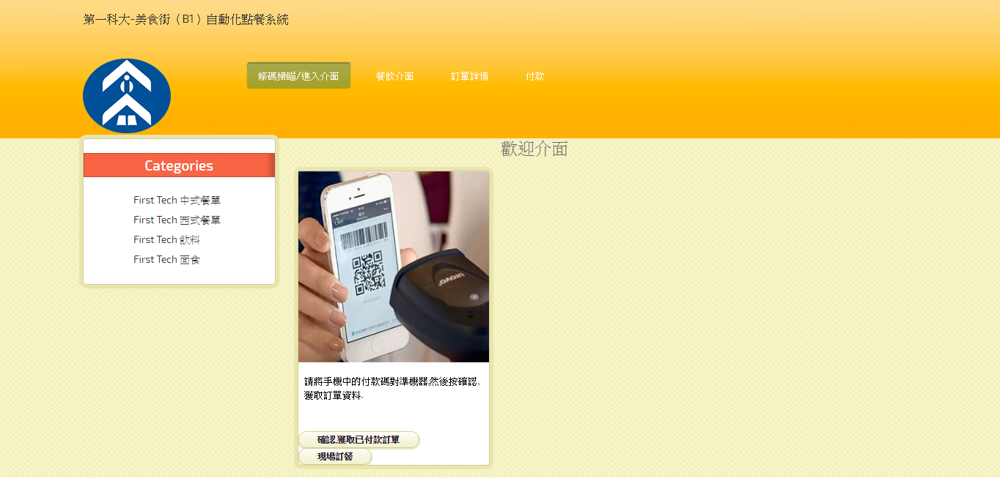
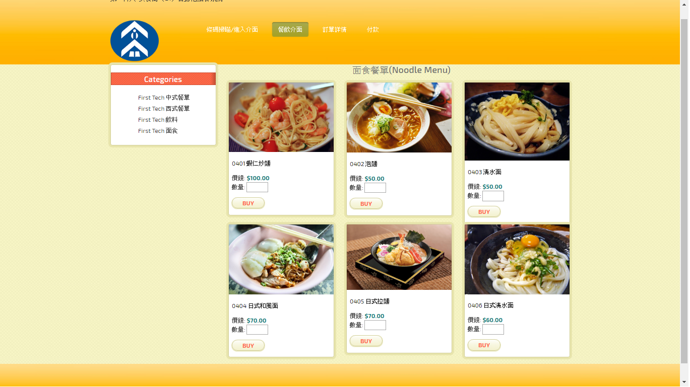
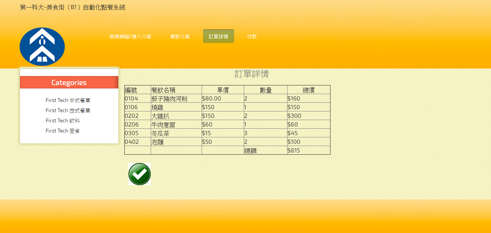
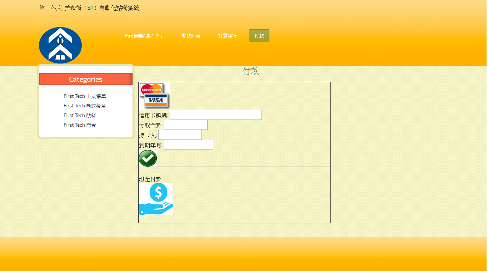
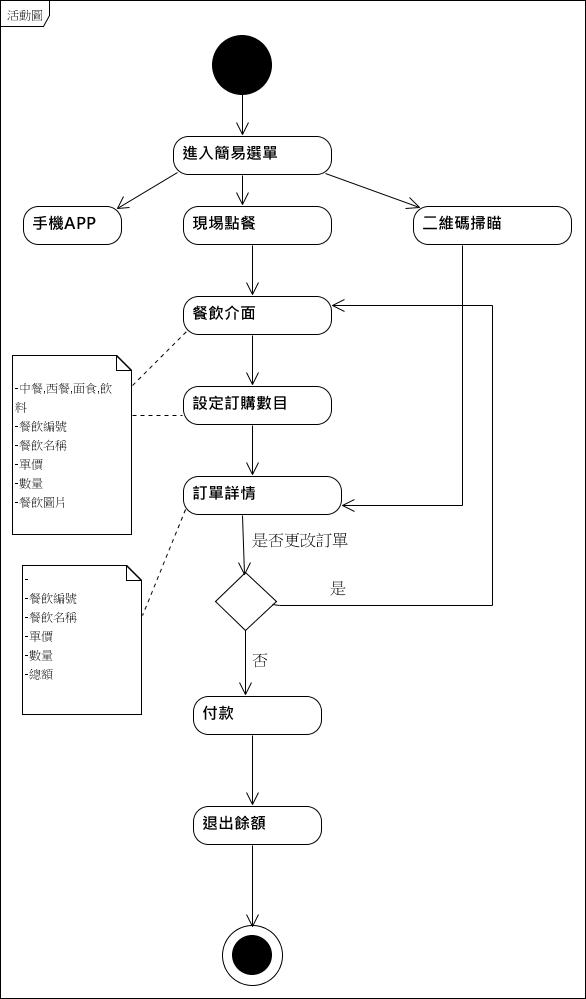
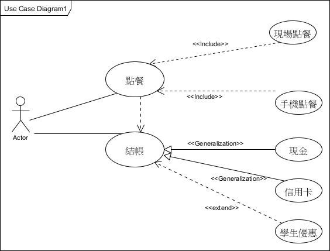
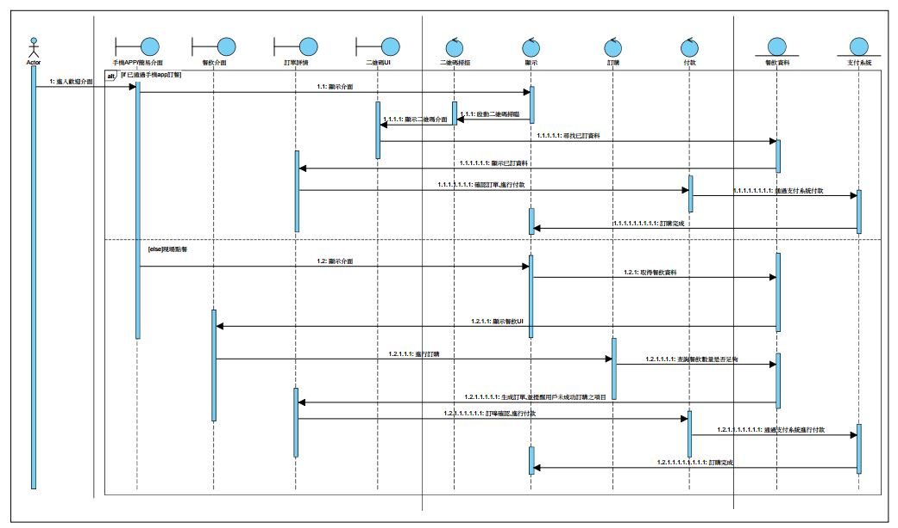
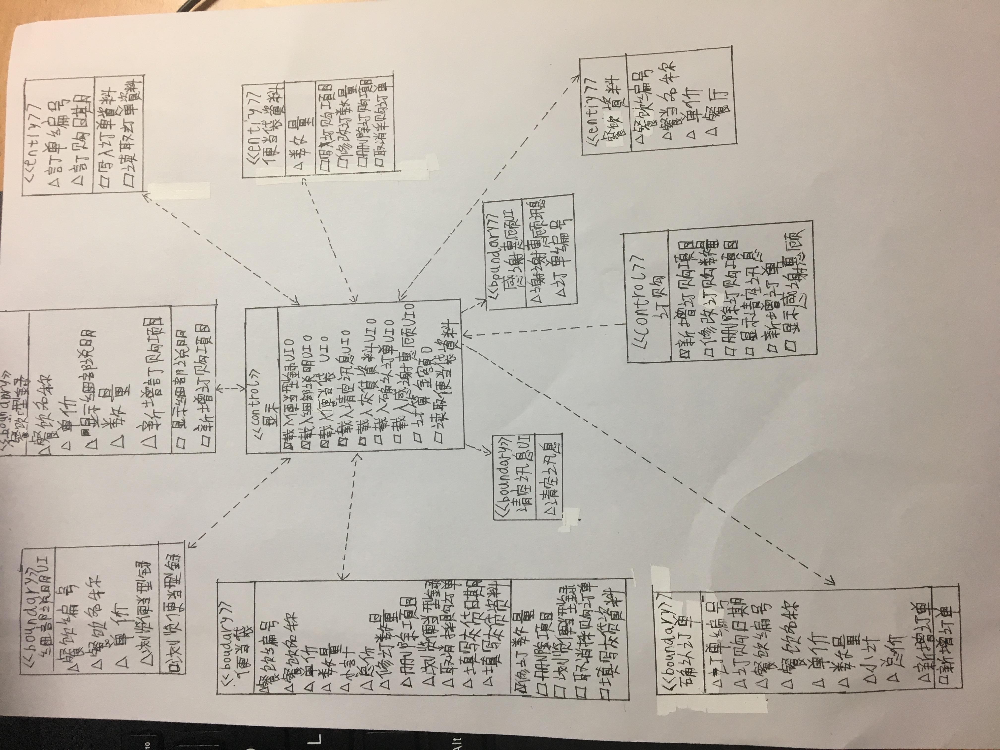

# Group-members

資訊管理系3C 0524301 吳偉雄(組長)

資訊管理系3C 0524302 朱煒

資訊管理系3C 0524303 甯陽

#
#一.專題概述
##自動化點餐系統
台灣的餐飲行業的點餐平台相對起步較晚，在移動互聯網時代，越來越多的人開始通過移動終端進行便捷的消費，大大的便捷了大眾的生活，科技以人為本，技術改變生活。在這一片空白的市場存在著巨大的機遇與挑戰。而我們的項目就是在這一片機遇中應運而生。

在設計過程中充分綜合台灣用戶的使用習慣，以及操作方式，為了使得設計能夠更加的簡單、實用、以及人性化考慮，根據專案的需求設計了兩套操作介面，一套用於實地自動化點餐系統，一套用於移動終端APP應用。

網上支付分析：台灣的第三方支付交易體系暫時還不太成熟，經過對系統的分析，最後選定信用卡或VISA金融卡作為APP網上支付方式，同時結合線下交易現金支付。

#二.專題視頻
 https://youtu.be/LXGQeCv8yh0 
 
#三.UI介面 

#四.活動圖

#五.個案圖

#六.強韌圖
.jpg)
.JPG)

#七.循序圖

#八.類別圖

